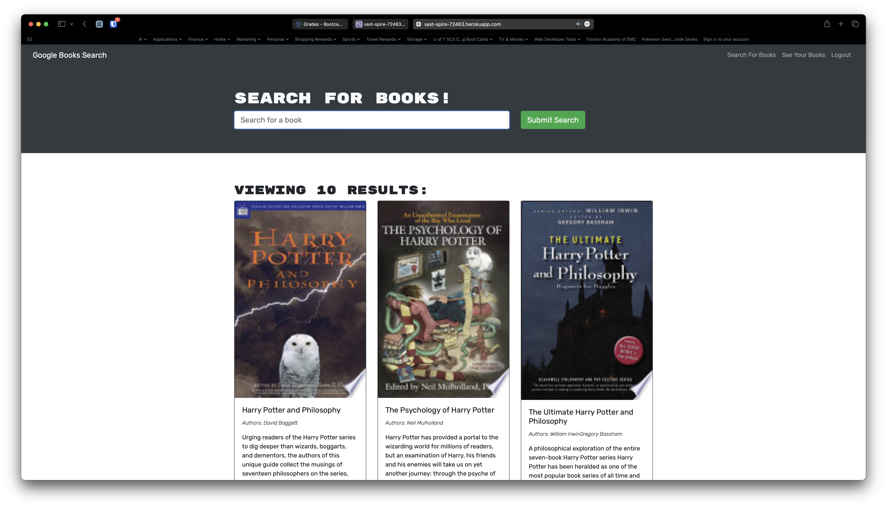

# Book Search Engine
## License
 The application is covered under the [MIT License](https://opensource.org/licenses/MIT).
## Description
As an avid reader, my motivation is to create a robust book search engine with personalized features, allowing me to discover new books, save them for future reference, and easily manage my reading preferences and saved books. I built this project to fulfill the needs of avid readers like myself, providing a user-friendly book search engine that enables efficient discovery, organization, and tracking of books, empowering users to create personalized reading lists and enhance their overall reading experience. By developing this book search engine, I aimed to address the challenge of efficiently searching and organizing books, offering a comprehensive solution that simplifies the process of finding, saving, and managing book recommendations, ultimately enhancing the overall book discovery and reading experience for users. Through the process of building this project, I gained valuable experience in implementing a GraphQL API with Apollo Server, integrating authentication middleware, and deploying a MERN stack application to Heroku, allowing me to enhance my skills in modern web development technologies and deepen my understanding of data-driven and user-centric application design.
## Table of Contents:
1. [Installation](#installation)
2. [Usage](#usage)
3. [Credits](#credits)
4. [Features](#features)
5. [Contribute](#contribute)
6. [Test](#test)
7. [Questions](#questions)

## Installation
1. No installation required
2. Go to this [link](https://vast-spire-72463.herokuapp.com)

## Usage
Welcome to the Book Search Engine! To get started, use the search bar to explore a wide range of books. Once you find a book you like, click "Save This Book!" to add it to your reading list. You can access your saved books by clicking "See Your Books". To remove a book from your list, simply click the "Remove" button. If you want to personalize your experience, create an account or log in to access additional features like saving books, viewing your book count, and more. Enjoy discovering and organizing your next reading adventures with ease!

## Credits
### Collaborators
None
### Third-Party
1. [React](https://react.dev)
2. [Apollo Server](https://www.apollographql.com/docs/apollo-server/)
3. [Apollo Client](https://www.apollographql.com/docs/react/)
4. [MongoDB](https://www.mongodb.com)
5. [Mongoose](https://mongoosejs.com)
6. [Express.js](https://expressjs.com)
7. [Google Books API](https://developers.google.com/books)
8. [Heroku](https://id.heroku.com/login)
9. [npm (Node Package Manager)](https://www.npmjs.com)

### Tutorials

## Features
None

## Contribute
1. Fork the repository.
2. Create a new branch.
3. Write and test your code.
4. Commit your changes with detailed comments.
5. Push your changes to GitHub.
6. Open a pull request.
7. Merge your pull request.

## Test

## Questions
If you like to see my other projects, my GitHub username is [jason1chiu](https://github.com/jason1chiu) and my GitHub profile is [https://github.com/jason1chiu](https://github.com/jason1chiu). Furthermore you may email me at jasonchiu2@yahoo.com if you have any additional questions.
